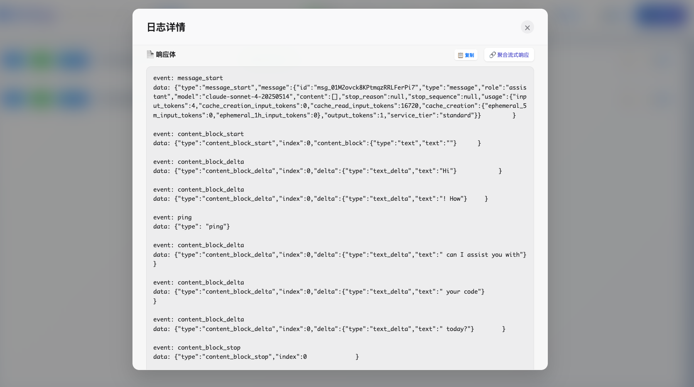
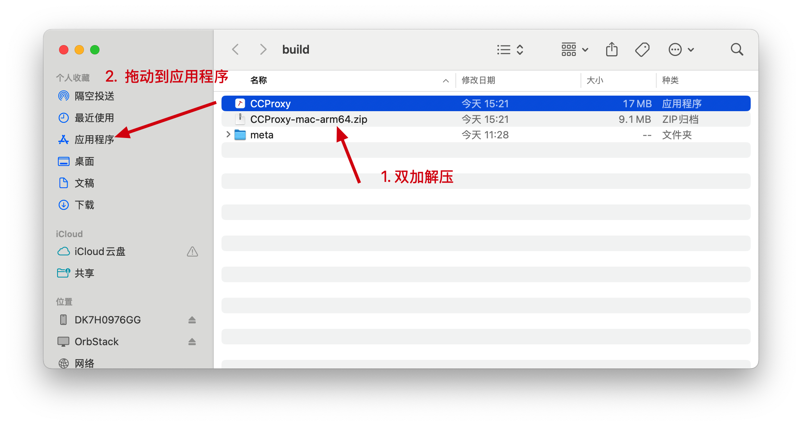
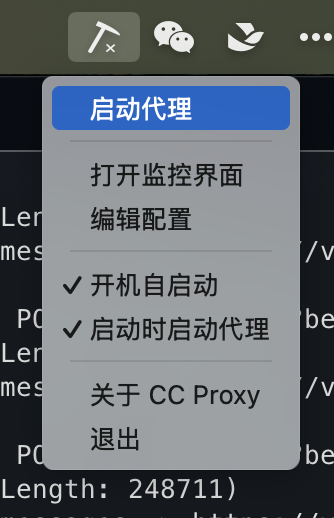
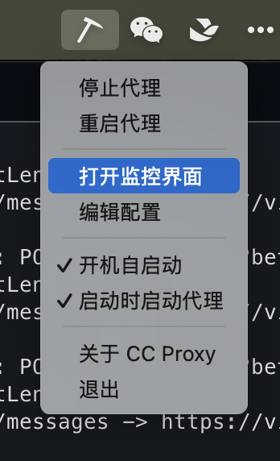

# claude code proxy

基于 golang 开发的通用 请求代理程序, 可以方便的查看 api 请求详情, 在使用 `claude code` 时派生此需求, 所以取名为 `ccproxy`

>! 本项目完全使用 cc 开发完成, readme 是我写的

## 安装

release 下载 [macos](https://github.com/daodao97/claude-code-proxy/releases) | [windows](https://github.com/daodao97/claude-code-proxy/releases)

## macos 使用演示











## 修改配置文件

配置文件, 可以使用托盘按钮打开, 根据实际请求修改 代理配置

`macos` 

```
~/.ccproxy/config.yaml
```

## 配置 cc 环境变量

```
export ANTHROPIC_BASE_URL=http://localhost:9527
export ANTHROPIC_AUTH_TOKEN=aicoding-d0904095b6c795abb6b
```

## 开发和构建

### 自动发布脚本

项目提供了完整的自动化发布脚本，位于 `scripts/` 目录：

#### 快速发布（推荐）

```bash
# 完全自动化：提交 → 构建 → 发布
./scripts/auto-release.sh

# 指定版本号
./scripts/auto-release.sh v1.0.0

# 跳过自动提交（手动控制 git）
./scripts/auto-release.sh --no-commit
```

#### 可用选项

```bash
# 查看帮助
./scripts/auto-release.sh --help

# 测试模式（不执行实际操作）
./scripts/auto-release.sh --dry-run

# 仅构建，不上传
./scripts/build-and-prepare.sh

# 跳过构建，仅上传现有文件
./scripts/auto-release.sh --no-build

# 清理构建产物
./scripts/auto-release.sh --clean-only
```

#### 脚本功能

`auto-release.sh` 会自动执行以下步骤：

1. ✅ **检查依赖** - 确保 GitHub CLI 等工具可用
2. ✅ **自动提交** - 提交未提交的更改（可用 `--no-commit` 跳过）
3. ✅ **清理构建** - 清理之前的构建产物
4. ✅ **跨平台构建**：
   - macOS ARM64: `CCProxy-mac-arm64.zip`
   - macOS Intel: `CCProxy-mac-amd64.zip`
   - Windows: `CCProxy-win-amd64.zip`
5. ✅ **GitHub 发布** - 创建/更新 GitHub Release
6. ✅ **上传文件** - 自动上传构建产物

#### 环境要求

```bash
# 安装 GitHub CLI
brew install gh

# 认证 GitHub（首次使用）
gh auth login

# 构建依赖（参见 tray/build.sh 文档）
```

#### 使用示例

```bash
# 场景1: 日常开发发布
git add .
git commit -m "feat: 新功能"
./scripts/auto-release.sh  # 自动检测版本并发布

# 场景2: 正式版本发布
git tag v1.0.0
git push origin v1.0.0
./scripts/auto-release.sh v1.0.0  # 使用指定版本

# 场景3: 仅构建测试
./scripts/build-and-prepare.sh  # 构建后显示手动上传说明
```

### 手动构建

如果需要手动构建特定平台：

```bash
cd tray

# 构建 Mac 版本
./build.sh mac arm64    # Apple Silicon
./build.sh mac amd64    # Intel

# 构建 Windows 版本  
./build.sh windows amd64

# 构建所有平台
./build.sh all
```

构建产物位于 `tray/build/` 目录。
